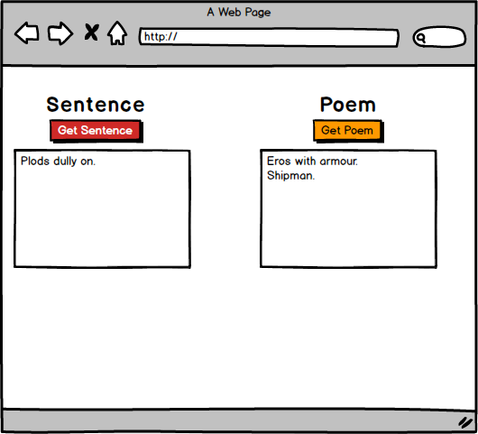

###First, Let's Thank These People For Making This Awesome API.  

Andrew           |  William
:-------------------------:|:-------------------------:
  |  


#Open up this link and read the documentation

###[Shake-It-Speare](http://shakeitspeare.com/)

Tonight you will be creating a simple app that renders a sentence and a poem from the shake-It-Speare API.

##Objective 1
Using the following route create an AJAX request that returns a JSON object from the API. 

``http://ShakeItSpeare.com/api/sentence``

Try hitting that link in your browser or in Postman.

This request should return an object that looks like this... 

```
{
	sentence: "Plods dully on.",
	markov: 2
}
```

Using this data, render the value of the ``sentence`` key in your browser.  You will need to use your DOM manipulation skills to make this happen.

##Objective 2
Create a button that renders a new sentence in the browser.  When the button is clicked a new sentence will appear and the previous sentence will no longer be rendered in the browser.  You will have to use your JavaScript DOM manipulation skills to make this happen.

##Objective 3
Using the following route create an AJAX request that returns a JSON object from the API.

``http://ShakeItSpeare.com/api/poem``

This request should return an object that looks like this...

```
{
	poem: "Eros with armour.
	Shipman.
	Encount.",
	markov: 2,
	lines: 3
}
```

Using the data, render the value of the ``poem`` key in your browser.  

##Objective 4
Add a button to the app that renders a new poem in the browser.  You will not be replacing the button that renders a sentence.  Take a look at the mockup below.  When the button is clicked a new poem that will appear and the previous poem will no longer be rendered in the browser.  This is very similar to what you created in Objectives 1 and 2.  



##Objective 5
Using the following route create three buttons that allow the user to render a poem by 5, 7 or 16 lines.  So three buttons that each render different strings.  If a user clicks a button the previous poem should be removed from the browser.  

``http://shakeitspeare.com/api/poem?lines=${NUMBER OF LINES HERE}``

so for example, 

``http://shakeitspeare.com/api/poem?lines=5``

will return this JSON...

```
{
	poem: "Tours.
	Disembark my coffers.
	Posterns.
	Vagabonds.
	Meekly.",
	markov: 2,
	lines: 5
}
```
##Objective 6
Please read.   

####Promises
[JavaScript Promises](https://developer.mozilla.org/en-US/docs/Web/JavaScript/Reference/Global_Objects/Promise)

[Eloquent JavaScript Chapter 17](http://eloquentjavascript.net/17_http.html)

####Testing
[Jasmine Intro](http://jasmine.github.io/2.0/introduction.html)

##A Great Bonus Objective
Do not replace the current functionality in your DOM.  This is a new feature!

Create a form in the same app that allows the user to input the amount of lines they want.  On form submit, the app renders a poem with that many lines.  Don't forget to prevent the default functionality of the form.  You will most likely Google this.  

As a type of validation, if the user inputs a number great than 10, render HTML on the DOM that says "The max is ten lines.  Please input a number less than or equal to 10".  That HTML should disappear after the user submits a valid number.   