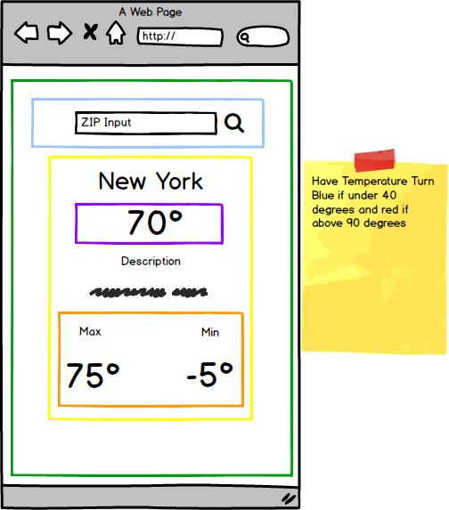

#A Mobile Weather App


###Step 1: The UI


<br>
<br>
<br>
<br>

###Step 2: Component Hierarchy




-  App 
	-  WeatherTable (Green)
		-  SearchBar (Blue)
	 	-  LocationDisplay (Yellow)
	  	 	-  TempDisplay (Purple)
	  	 	-  WeatherRange (Orange)

Regardless, always think about what components may need to be resused.  

___
###Step 3: Let's check out our API data.

Let's get everyone signed up for [Open Weather Map](https://home.openweathermap.org/users/sign_up)

After you've signed up your key should be in the [API Keys](https://home.openweathermap.org/api_keys) section.

Source your API key in your bash_profile as the environment variable ```OPEN_WEATHER_ID```

First let's verify they we have data to work with.  Make a request to the following URL in Postman.

```
http://api.openweathermap.org/data/2.5/weather?q=10025,us&appid=YOUR ID HERE

```

###Step 4: Identify Minimal UI State
-  The rendered weather data CurrentWeather in WeatherTable (State)
-  The search text the user has entered in SearchBar(State)