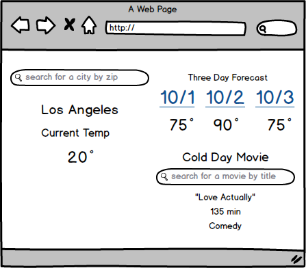

#Weather App Next Generation

This weekend you will be using the Open Weather Map API and OMDB API to build out an app that reports the weahter and suggests a movie if the current temp is below 40 degrees.  Refer to this documentation for the correct third party API endpoints.

##[Open Weather Map](http://openweathermap.org/api)

##[OMDB](https://www.omdbapi.com/)

 

###Features

Please use the mockup below to build out the UI for your app.  

All requests should be made to your Express server.

The user should be able to search for a city by zip.  The current temp and the three day forecast should be rendered.  You will need to hit a route on your server for the three day forecast.

I repeat, **ALL** requests should be made to your Express server.

**When the temperature is below 40 degrees** please render a form that allows the user to search for a movie per the mockup. The rendered response must come back from the OMDB API and include the title, runtime and genre.  This request must be sent to your server.

###Mockup

##The Awesome Feature: Text The Temp
Add an input to allow your app to text the temperature to a verified cell number via Twilio.